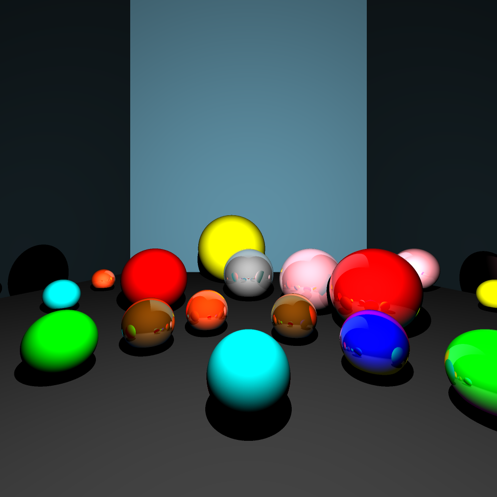
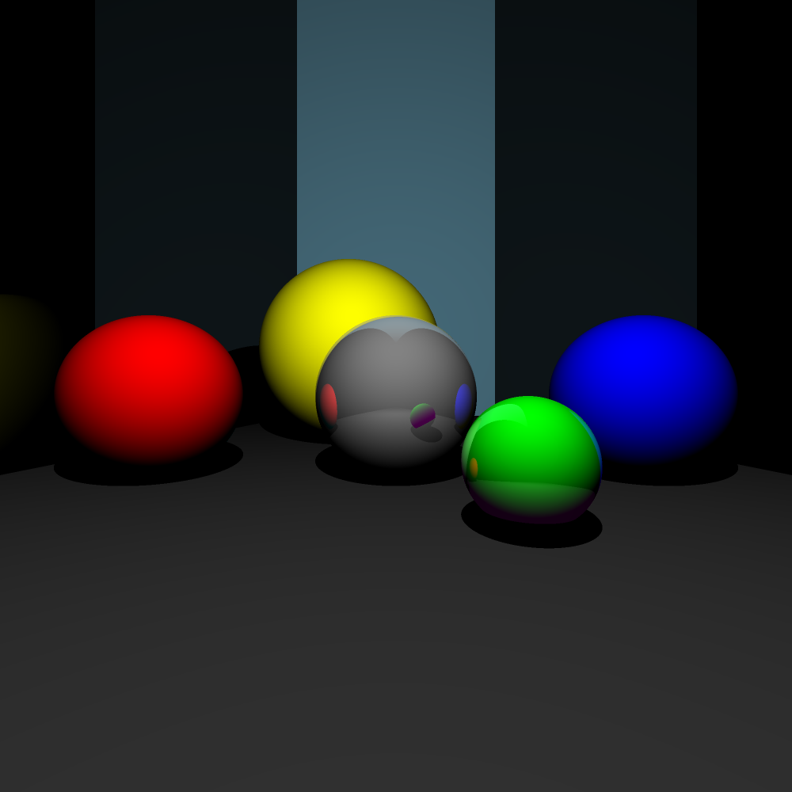
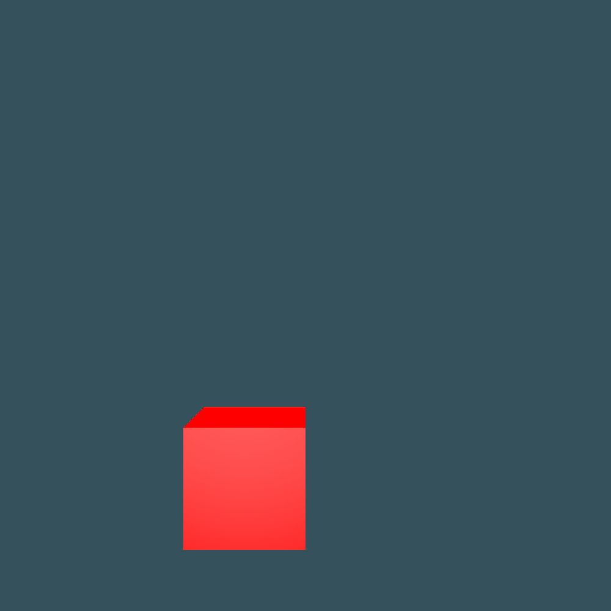
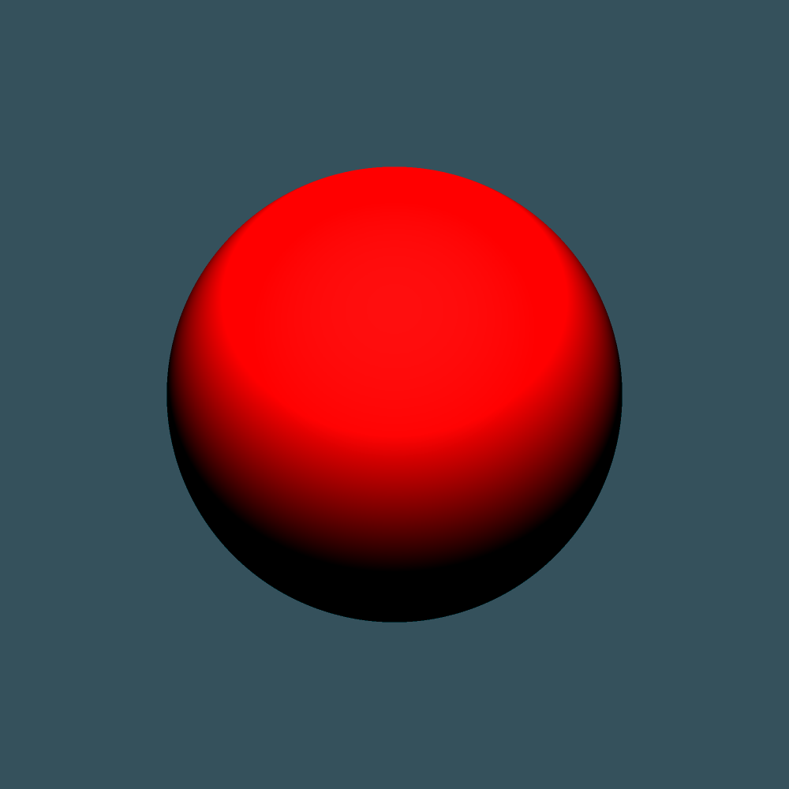
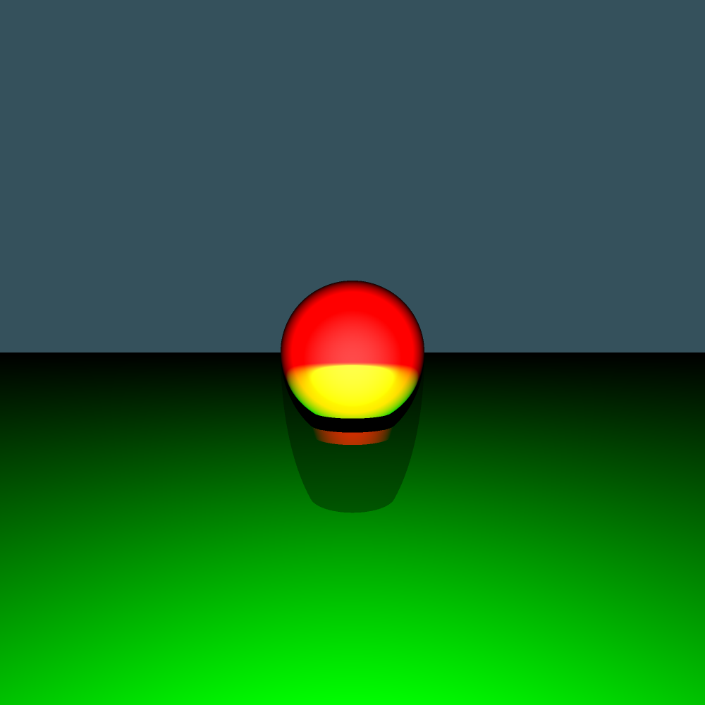

# GPU Ray Tracer

[Watch the video](https://youtu.be/-e_Pe3JDG8E)
[](https://youtu.be/-e_Pe3JDG8E)

## Requirements

* [Cuda Toolkit](https://developer.nvidia.com/cuda-downloads)
* C++ compiler ([g++](https://gcc.gnu.org/) for linux,  [MSVC](https://visualstudio.microsoft.com/downloads/) for Windows)
* [GPU supported by CUDA](https://en.wikipedia.org/wiki/CUDA#GPUs_supported)
* [CMake](https://cmake.org/download/)

## Build

CMake is used as build system.

### Linux
#### Release mode

```shell
mkdir build
cd build
cmake ..
make
```

#### Debug mode

```shell
mkdir build_debug
cd build_debug
cmake ..
make
```

## Run

The executable can be found in the build directory.

Usage:

 ``./raytracer input.scene output_directory width height nb_frames aliasing_level reflection_max_depth``

* **input.scene**: the input file (must have the .scene format)
* **output_directoy**: the output directory in which the frames are stored (ppm format)
*  **width**: width of the resolution of the output frame
*  **height**: height of the resolution of the output frame
* **nb_frames**: number of frames to record
*  **aliasing level**: level of aliasing by side. (i.e if aliasing level equals to 2, compute the mean of 2x2=4 pixels)
* **reflection_max_depth**: the maximum depth for the reflection

## Features
### Translatable Geometric figures

* Plan
* Sphere
* Raybox
* Triangle

### Aliasing

According to the aliasing level (supposed n here), compute the mean color of nxn subpixels of the current pixel 

### Reflection

The return of light. The reflection is restricted to the maximum reflection depth given as arguments.

## Scenes

The raytracer reads a specific file format ``.scene``.

A scene consists of a camera, a collection of lights and a collection of translatable and intersectable objects (geometric figures)

### Sample

A scene file ``scenes/sample.scene`` describes how to write a scene file for each geometric figures, camera and lights. 

### Examples

Several more samples can be found in ``scenes/*``:
 * ``scenes/frames``: scenes are static (thus it is not needed to render more than one frame)
 * ``scenes/video``: scenes are static (thus it is not needed to render more than one frame)


## Output

### Video Rendering

[Watch the video](https://youtu.be/-e_Pe3JDG8E)
[](https://youtu.be/-e_Pe3JDG8E)

### Frame Rendering

<p float="left">






</p>